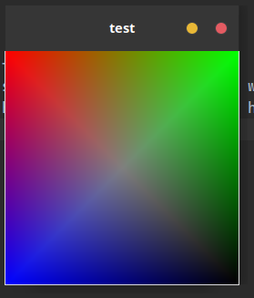

# sctk_gtk

GTK style sctk frame

This crates aim to provide GTK style sctk frame

consider GNOME Wayland doesn't provide SSD(server side decoration), using GTK to draw the frame maybe the only way to
let window title looks like native

## features

- [x] GTK style frame
- [ ] GTK style shadow (I still don't know what GTK widget can do this job)
- [ ] GTK style button animation (yes, GTK head bar button has animation)

## screenshots

